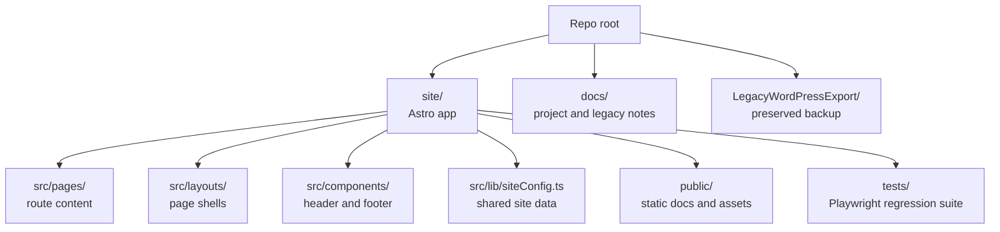

# Repo Discovery Guide (agent-only)

This document is an internal discovery and maintenance index for coding agents working in `urbanahighlandshoa`. It is not user-facing documentation.

Use this file like a cache.

- Prefer updating it when you discover drift in paths, scripts, CI behavior, or hosting assumptions.
- Treat the “Last verified” timestamp as the trust signal. If you only reorganize prose, do not update it.

## Table of Contents

- Maintenance snapshot
- High-signal docs (read-first index)
- Module map (ownership + boundaries)
- Runtime entry points
- High-signal code anchors
- CI reality (verified)
- Repo-specific gotchas
- When to update this file

## Maintenance snapshot

- Last verified: 2026-03-15
- Verification scope (high level): repo layout, Astro site entrypoints, Node 24 tooling baseline, GitHub Pages deployment flow, regression workflow behavior, Copilot bootstrap workflow, devcontainer baseline, and Project Pages base-path handling.

Keep this section short. The goal is to preserve why the file is trustworthy, not to duplicate the full repository documentation.

## 1. High-signal docs (read-first index)

Additional files to check beyond the mandatory startup reads in `AGENTS.md`:

- Main project overview: `README.md`
- Agent rules and repo gotchas: `AGENTS.md`
- Legacy-site context: `docs/legacywebsite/LEGACY_SITE_NOTES.md`
- Deploy workflow: `.github/workflows/deploy.yml`
- Manual regression workflow: `.github/workflows/regression-tests.yml`
- Copilot bootstrap workflow: `.github/workflows/copilot-setup-steps.yml`
- Shared workflow setup action: `.github/actions/setup-site/action.yml`
- Astro hosting configuration: `site/astro.config.mjs`
- Browser regression coverage: `site/tests/regression.spec.ts`

Other high-signal agent anchors:

- Congruency gate: `.github/instructions/congruency-review.instructions.md`
- External-doc verification rule: `.github/instructions/context7.instructions.md`
- Shell scripting rules: `.github/instructions/shell.instructions.md`

## 2. Module map (ownership + boundaries)

Quick navigation anchors:

- Astro app root: `site/`
- Route content: `site/src/pages/`
- Shared components: `site/src/components/`
- Layout shells: `site/src/layouts/`
- Shared site metadata: `site/src/lib/siteConfig.ts`
- Global styling: `site/src/styles/global.css`
- Static assets and PDFs: `site/public/`
- Regression tests: `site/tests/regression.spec.ts`
- Legacy backup: `LegacyWordPressExport/`

## 3. Runtime entry points

Local development baseline:

- Install dependencies: `cd site && npm install`
- Start dev server: `cd site && npm run dev`
- Run Astro validation: `cd site && npm run check`
- Build production output: `cd site && npm run build`
- Run Playwright suite: `cd site && npm test`
- Install Playwright browser plus Linux dependencies: `cd site && npm run test:install`

Important local URL behavior:

- This repo uses GitHub Pages Project Pages under `/urbanahighlandshoa/`.
- Local dev and preview URLs must include that base path.
- The root `/` path will 404 locally when the configured base path is active.

Devcontainer nuance:

- Devcontainer definition lives at `.devcontainer/devcontainer.json`.
- Current image baseline is `mcr.microsoft.com/devcontainers/javascript-node:4-24-trixie`.
- Avoid wiring `cd site && npm ci && npm run test:install` into `postCreateCommand`; in this repo that startup hook can stall the container.
- Safer sequence after container startup: `cd site && npm ci && npm run test:install`.

## 4. High-signal code anchors

These are the fastest places to start reading for behavior and content changes:

- Hosting and base path: `site/astro.config.mjs`
- Home page: `site/src/pages/index.astro`
- Section pages: `site/src/pages/announcements/index.astro`, `site/src/pages/events/index.astro`, `site/src/pages/documents/index.astro`, `site/src/pages/resources/index.astro`, `site/src/pages/contact/index.astro`
- Shared header and nav: `site/src/components/Header.astro`
- Shared footer: `site/src/components/Footer.astro`
- Base HTML shell: `site/src/layouts/BaseLayout.astro`
- Standard page wrapper: `site/src/layouts/PageLayout.astro`
- Shared site-level data: `site/src/lib/siteConfig.ts`
- Regression coverage: `site/tests/regression.spec.ts`

## 5. CI reality (verified)

Workflow files:

- `.github/workflows/deploy.yml`
- `.github/workflows/regression-tests.yml`
- `.github/workflows/copilot-setup-steps.yml`

Behavior summary (verified):

- `deploy.yml` triggers on pushes to `main` and manual workflow dispatch.
- Production deploys are gated by a `verify` job before the `deploy` job runs.
- The `verify` job checks out the repo, uses `.github/actions/setup-site`, installs Playwright browsers via `npm run test:install`, runs `npm run check`, builds the site, runs Playwright regression tests, uploads the Playwright report, packages `site/dist` into the `github-pages` tar artifact, and uploads that artifact with `actions/upload-artifact@v6`.
- The deploy job publishes the previously uploaded Pages artifact with `actions/deploy-pages@v4`.
- `regression-tests.yml` is a manual workflow that mirrors the build-and-test portion without deploying.
- `.github/actions/setup-site/action.yml` is the shared CI bootstrap path; it installs Node 24 through `actions/setup-node@v6`, enables npm caching, and runs `npm ci` in `site/`.
- `.github/workflows/copilot-setup-steps.yml` is the Copilot coding-agent bootstrap workflow. The job name must remain `copilot-setup-steps` for agent pickup.
- This Copilot bootstrap workflow is unrelated to GitHub Agentic Workflows via `gh aw`; `gh aw` is a CLI surface for authoring and running agentic workflows, not a replacement for Copilot setup steps.
- `deploy.yml` and `regression-tests.yml` opt JavaScript actions into Node 24 with `FORCE_JAVASCRIPT_ACTIONS_TO_NODE24=true`. The deploy workflow also avoids `actions/upload-pages-artifact@v4` because that wrapper still pins a Node 20-era `upload-artifact` SHA that emits deprecation warnings on current runners.
- `copilot-setup-steps.yml` should stay close to GitHub's documented Copilot setup-step shape because unsupported workflow customizations may be ignored by Copilot.

## 6. Repo-specific gotchas

- Repo root is not the Astro app root. Most implementation work belongs under `site/`.
- GitHub Pages is Project Pages, so internal links and public assets should use `import.meta.env.BASE_URL` when appropriate.
- `LegacyWordPressExport/` is a preserved backup and should not be casually modified or removed.
- Keep repo-root documentation canonical; avoid introducing duplicate top-level README variants under `site/`.
- Before sharing a local or production URL with the user, verify that exact URL renders successfully.

## 7. When to update this file

- If the site root, route structure, or major shared code anchors change.
- If local development commands or the Node baseline change.
- If Pages hosting assumptions or the base path change.
- If CI stage order, shared workflow bootstrap, or Copilot bootstrap behavior changes.
